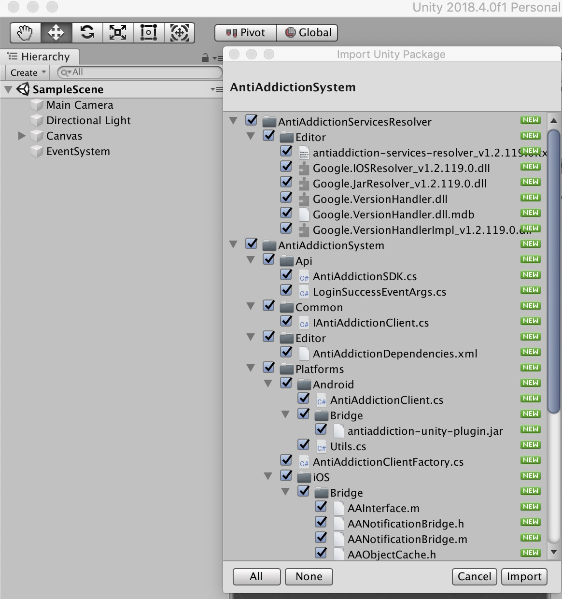
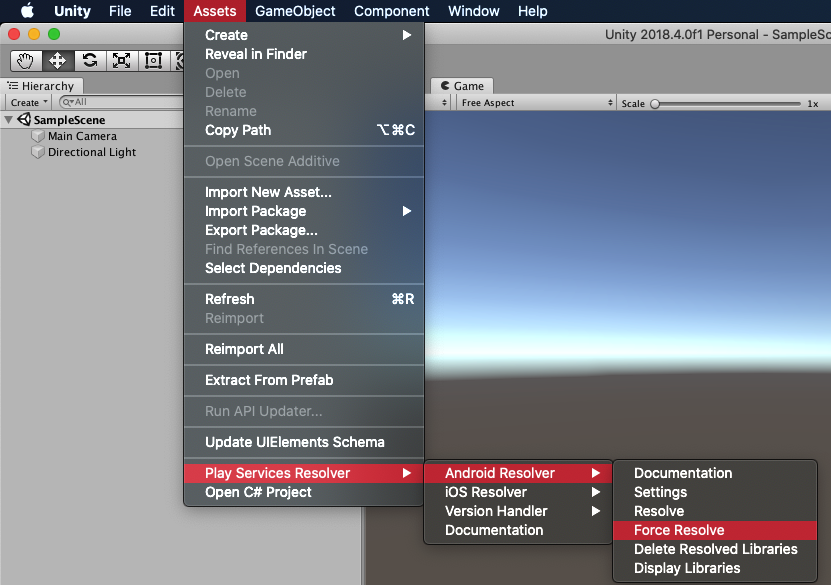
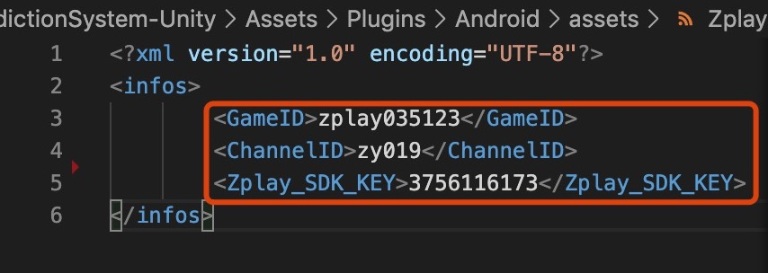

# 入门指南

本指南适用于希望通过 Unity 接入防沉迷功能的发布商。  


## 前提条件  

- 在 iOS 上部署  
  - Xcode 10 或更高版本  
  - iOS 8.0 或更高版本  
  - [CocoaPods](https://guides.cocoapods.org/using/getting-started.html)  

- 在 Android 上部署
  - 定位到 Android API 级别 14 或更高级别  

- [Demo](https://github.com/yumimobi/AntiAddictionSystem-Unity)

## 下载防沉迷 Unity 插件  

借助防沉迷 Unity 插件，Unity 开发者无需编写 Java 或 Objective-C 代码，即可轻松地在 Android 和 iOS 应用上实现防沉迷的功能。  
该插件提供了一个 C# 界面，用于 Unity 项目中 C# 脚本使用防沉迷功能。

请通过如下链接下载该插件的 Unity 软件包，或在 GitHub 上查看其代码。

[下载插件](https://github.com/yumimobi/AntiAddictionSystem-Unity/releases/download/1.0.0/AntiAddictionSystem.unitypackage)  
[查看源代码](https://github.com/yumimobi/AntiAddictionSystem-Unity) 

### 导入防沉迷 Unity 插件

在 Unity 编辑器中打开您的项目，然后依次选择 Assets > Import Package > Custom Package，并找到您下载的 AntiAddictionSystem.unitypackage 文件。  


确保选择所有文件，然后点击 Import。

  

### 加入防沉迷 SDK  

防沉迷 Unity 插件随 Unity Play [服务解析器库](https://github.com/googlesamples/unity-jar-resolver)一起发布。 此库旨在供需要访问 Android 特定库（例如 AAR）或 iOS CocoaPods 的所有 Unity 插件使用。它为 Unity 插件提供了声明依赖项的功能，然后依赖项会被自动解析并复制到 Unity 项目中。

请按照下列步骤操作，确保您的项目包含防沉迷 SDK。 

##### 1. 部署到 iOS   

您无需执行其他步骤即可将防沉迷 SDK 加入 Unity 项目中。  
*注意：iOS 依赖项的标识是通过 CocoaPods 完成的，而 CocoaPods 是构建过程完成后的一个运行步骤。*  

##### 2. 部署到 Android  

在 Unity 编辑器中，依次选择 Assets > Play Services Resolver > Android Resolver > Resolve。  
Unity Play 服务解析器库会将声明的依赖项复制到 Unity 应用的 Assets/Plugins/Android 目录中。  

*注意：防沉迷 Unity 插件依赖项位于 Assets/AntiAddictionSystem/Editor/AntiAddictionSystemDependencies.xml 中*  

  

### 配置防沉迷SDK参数

#### 配置 iOS 参数
请在info.plist中添加如下参数。
参数获取请联系产品。
```
    <key>gamecode</key>
    <string>123</string>
    <key>zchannelid</key>
    <string>123</string>
    <key>zkey</key>
    <string>3756116173</string>
```

#### 配置 Android 参数

请修改Assets/Plugins/Android/assets/ZplayConfig.xml文件中的参数
  

`提示：ZplayConfig.xml文件中的GameID，ChannelID，Zplay_SDK_KEY参数，请联系掌游产品获取`


# 快速接入

### 1. 创建 AntiAddictionSDK

```c#
using System;
using UnityEngine;
using AntiAddictionSystem.Api;
using UnityEngine.UI;

public class AntiAddictionDemoScript : MonoBehaviour
{


AntiAddictionSDK antiAddictionSDK;

  void Start() 
  {
    antiAddictionSDK = new AntiAddictionSDK();
    antiAddictionSDK.OnPrivacyPolicyShown += HandlePrivacyPolicyShown;
    antiAddictionSDK.OnUserAgreesToPrivacyPolicy += HandleUserAgreesToPrivacyPolicy;
    antiAddictionSDK.OnLoginSuccess += HandleLoginSuccess;
    antiAddictionSDK.OnLoginHasBeenShown += HandleLoginHasBeenShown;
    antiAddictionSDK.OnLoginHasBeenDismissed += HandleLoginHasBeenDismissed;
    antiAddictionSDK.OnLoginFail += HandleLoginFail;
    antiAddictionSDK.OnUserAuthVcHasBeenShown += HandleUserAuthVcHasBeenShown;
    antiAddictionSDK.OnUserAuthSuccess += HandleUserAuthSuccess;
    antiAddictionSDK.OnWarningHasBeenShown += HandleWarningHasBeenShown;
    antiAddictionSDK.OnUserClickLoginButton += HandleUserClickLoginButton;
    antiAddictionSDK.OnUserClickQuitButton += HandleUserClickQuitButton;
    antiAddictionSDK.OnUserClickConfirmButton += HandleUserClickConfirmButton;
    antiAddictionSDK.OnLoginFail += HandleLoginFail;
    antiAddictionSDK.OnLogoutCallback += HandleLogoutCallback;
    antiAddictionSDK.OnCanPay += HandleCanPay;
    antiAddictionSDK.OnProhibitPay += HandleProhibitPay;
  }
#region AntiAddiction callback handlers
 //隐私协议回调   
    //隐私协议窗口展示接口
    public void HandlePrivacyPolicyShown(object sender, EventArgs args)
    {
        print("AntiAddiction---HandlePrivacyPolicyShown");
    }
    //用户同意隐私协议
    public void HandleUserAgreesToPrivacyPolicy(object sender, EventArgs args)
    {
        print("AntiAddiction---HandleUserAgreesToPrivacyPolicy");
    }

//登录接口
    //登录界面展示回调
    public void HandleLoginHasBeenShown(object sender, EventArgs args)
    {
        print("AntiAddiction---HandleLoginHasBeenShown");
    }
    //登录界面关闭回调
    public void HandleLoginHasBeenDismissed(object sender, EventArgs args)
    {
        print("AntiAddiction---HandleLoginHasBeenDismissed");
    }
    //登录成功回调
    public void HandleLoginSuccess(object sender, LoginSuccessEventArgs args)
    {
        String zplayId = args.Message;
        print("AntiAddiction---HandleLoginSuccess: " + zplayId);
    }
    //登录失败回调
    public void HandleLoginFail(object sender, EventArgs args)
    {
        print("AntiAddiction---HandleLoginFail");
    }

//实名认证回调
    //实名认证界面展示回调
    public void HandleUserAuthVcHasBeenShown(object sender, EventArgs args)
    {
        print("AntiAddiction---HandleUserAuthVcHasBeenShown");
    }
    //实名认证通过回调
    public void HandleUserAuthSuccess(object sender, EventArgs args)
    {
        print("AntiAddiction---HandleUserAuthSuccess");
    }

//防沉迷SDK提示界面回调
//当提示界面展示时，应用需通过监听下列回调，进行应用逻辑的调整
//以下会介绍每个回调使用场景

    //当触发防沉迷逻辑时，防沉迷SDK会有弹窗提示，任意弹窗显示时应用都会收到此回调
    public void HandleWarningHasBeenShown(object sender, EventArgs args)
    {
        print("AntiAddiction---HandleWarningHasBeenShown");
    }

    //未成年用户游戏时长达上限，用户退出游戏回调
    //使用场景：
    //当未成年用户在游戏中时长已到，防沉迷SDK会弹窗提示用户退出游戏，用户点击弹窗上退出游戏按钮时，应用会收到此回调
    //当用户点击退出游戏按钮后，防沉迷SDK会退出游戏，请收到此回调后进行数据保存等相关处理
    public void HandleUserClickQuitButton(object sender, EventArgs args)
    {
        print("AntiAddiction---HandleUserClickQuitButton");
    }

    //未成年用户不可支付，用户点击弹窗“确定”按钮回调
    //使用场景：
    //当用户发起支付，支付不被允许时，防沉迷SDK会弹出弹窗提示用户不可支付，并且有确定按钮
    //当用户点击弹窗上的确定按钮时，应用会收到此回调，防沉迷SDK会关闭弹窗回到应用
    public void HandleUserClickConfirmButton(object sender, EventArgs args)
    {
        print("AntiAddiction---HandleUserClickConfirmButton");
    }
    
    //用户点击弹窗“登录”按钮回调
    //使用场景：
    //按照规定，用户未登录时不可发起支付，因此用户未登录状态下支付时，防沉迷SDK会弹出弹窗提示用户登录，当用户点击登录按钮后应用会收到此回调
    //收到此回调后游戏需引导用户进行登录，若用户选择不登录，仍旧可以继续游戏
    public void HandleUserClickLoginButtonInPayment(object sender, EventArgs args)
    {
        print("AntiAddiction---HandleUserClickLoginButtonInPayment");
    }

    //游客游戏时长达上限回调
    //使用场景：
    //若用户未登录，游戏时长已到时，应用会接收到此回调
    //防沉迷SDK会弹出弹窗,让用户去选择登录或是退出游戏，登录后才可继续游戏
    //游戏需要引导用户进行登录，用户不登录则不可继续游戏的逻辑。
        public void HandleUserClickLoginButtonInNoTimeLeft(object sender, EventArgs args)
    {
        print("AntiAddiction---HandleUserClickLoginButtonInNoTimeLeft");
    }

//退出登录接口回调
    //使用场景：当游戏有退出登录或切换账号功能时，当用户退出当前登录账号时应用会收到此回调
    public void HandleLogoutCallback(object sender, EventArgs args)
    {
        print("AntiAddiction---HandleLogoutCallback");
    }

//支付检测接口回调
    //允许支付回调
    public void HandleCanPay(object sender, EventArgs args)
    {
        print("AntiAddiction---HandleCanPay");
    }
    //不允许支付
    //使用场景：当用户单笔支付金额或当月累计支付金额超过限制时，应用会收到此弹窗
    public void HandleProhibitPay(object sender, EventArgs args)
    {
        print("AntiAddiction---HandleProhibitPay");
    }

#endregion
}
```  

### 2. 展示隐私政策接口
在APP启动时调用展示隐私政策接口（iOS应用需确保此时根视图已加载完成）。

此接口为防沉迷逻辑入口，请确保每次启动应用都调用此方法。
您无需判断用户是否已经同意隐私政策，SDK将自动判断。

```c#
if (antiAddictionSDK != null)
{
    antiAddictionSDK.ShowPrivacyPolicyView();
}
```  

### 3. 登录相关接口


<span style="color:rgb(150,0,0);">
<b>重要提示：</b> 应用必须选择下面的一种登录方式进行登录，登录成功之后，防沉迷SDK会自动弹出用户实名认证界面，我们提供了4种登录接口，您可根据项目需要选择使用您需要的接口。
</span>

##### 3.1. 防沉迷SDK登录接口（使用防沉迷SDK登录界面）
`注：若您的APP无登录功能、无登录界面，使用防沉迷SDK的登录功能可调用此接口。`

登录界面由SDK实现，您只需监听`HandleLoginSuccess()`,`HandleLoginFail()`,判断用户是否登录成功，进而执行应用逻辑。

```c#
if (antiAddictionSDK != null)
{
    antiAddictionSDK.ShowLoginViewController();
}
```

##### 3.2. 防沉迷SDK登录接口（不使用防沉迷SDK登录界面）
`注：若您的APP有登录页面，只需使用我方登录接口，可调用此接口`

应用如果使用游戏自己设计的登录界面，可以将登录界面中用户输入的账号密码传给防沉迷SDK，使用下面的接口进行登录。
您可监听`HandleLoginSuccess()`,`HandleLoginFail()`,判断用户是否登录成功。

```c#
if (antiAddictionSDK != null)
{
    //username：账号
    //password：密码
    antiAddictionSDK.LoginWithUserName(username, password);
}
```

##### 3.3. 三方登录接口
`注：若您的APP已经接入微信登录、QQ登录等非ZPLAY登录，需调用此接口`
将其他登录平台返回的用户唯一标识通过以下接口传给防沉迷SDK，以此进行登录，您可监听`HandleLoginSuccess()`,`HandleLoginFail()`,判断用户是否登录成功。

```c#
if (antiAddictionSDK != null)
{   
    //token：三方平台返回的唯一标识
    //otherID：三方平台返回的用户Id，没有的话传token
    //platformName：平台名称，请联系掌游产品获取
    antiAddictionSDK.LoginWithPlatformToken(token, otherID, platformName);
}
```

##### 3.4. Zplay封装的三方登录SDK接口
若您使用Zplay封装的三方登录SDK，在获取到了登录成功之后的zplayId，请使用下面的接口进行登录，您可监听`HandleLoginSuccess()`,`HandleLoginFail()`,判断用户是否登录成功。
```c#
if (antiAddictionSDK != null)
{
    //zplayID：Zplay封装的登录SDK返回的zplayID
    antiAddictionSDK.LoginWithZplayID(zplayID);
}
```

### 4. 实名认证接口
若用户按照上述登录流程登录后，无需调用此方法，防沉迷SDK会自行处理。

若用户进入游戏未登录时会默认进入游客模式，此时您需要用户进行实名认证时请调用以下接口

```c#
if (antiAddictionSDK != null)
{
    antiAddictionSDK.ShowUserAuthenticationViewController();
}
```

### 5. 退出登录接口
若您的APP在用户登录后提供退出登录或切换账号的功能，在用户退出登录时需调用此接口

```c#
if (antiAddictionSDK != null)
{
    antiAddictionSDK.LoginOut();
}
```

### 6. 支付相关接口
根据国家规定，对未成年人在游戏中的单笔付费金额和每月累计付费金额都有限制，因此在用户发起支付时需要调用`是否允许支付接口`，用户支付成功后需要调用`用户支付成功上报`接口。

##### 6.1. 是否允许支付接口
用户支付之前，调用此接口检测，返回可支付后才可发起支付。
您可监听`HandleCanPay()`,`HandleProhibitPay()`,判断用户是否可以支付。

```c#
if (antiAddictionSDK != null)
{
    //payNumber：用户本次支付的金额，单位分
    antiAddictionSDK.CheckNumberLimitBeforePayment(payNumber);
}
```

##### 6.2. 用户支付成功上报接口
用户支付成功后，请通过以下接口将用户的支付金额传给防沉迷SDK。
```c#
if (antiAddictionSDK != null)
{   
    //payNumber：用户本次支付成功的金额，单位分
    antiAddictionSDK.ReportNumberAfterPayment(payNumber);
}
```

### 7. 其他接口
`注：在Android中，7.1及7.2为必须调用接口，7.3及7.4为非必须调用接口；在iOS中，以下接口均为非必须调用接口`

##### 7.1. 游戏退到后台接口（iOS无需调用）
此接口仅适用于Android，iOS平台无需调用。

当Android用户按home键，将游戏退出到后台时，请务必调用下面的接口

<span style="color:rgb(255,0,0);">
<b>重要提示：</b> 游戏退到后台接口必须调用，不调用会导致防沉迷SDK计算游戏时长错误
</span>

```c#
if (antiAddictionSDK != null)
{
    antiAddictionSDK.GameOnPause();
}
```

##### 7.2. 游戏恢复前台接口（iOS无需调用）
此接口仅适用于Android，iOS平台无需调用。

当Android用户将游戏恢复到前台时，请务必调用下面的接口

<span style="color:rgb(255,0,0);">
<b>重要提示：</b> 游戏恢复前台接口必须调用，不调用会导致防沉迷SDK计算游戏时长错误
</span>

```c#
if (antiAddictionSDK != null)
{
    antiAddictionSDK.GameOnResume();
}
```

##### 7.3. 获取当前登录状态接口
请使用下面的接口获取当前用户的登录状态
```c#
if (antiAddictionSDK != null)
{
     // 获取当前用户登录状态
    // 0: 未登录
    // 1: 游客
    // 2: 正式用户
    string loginStatus = antiAddictionSDK.GetUserLoginStatus();
}
```

##### 7.4. 获取用户的认证身份
获取当前用户的实名认证身份
```c#
if (antiAddictionSDK != null)
{
    // 获取用户的认证身份
    // 0: 未知
    // 1：已成年
    // 2: 未成年
    string userAuthenticationIdentity = antiAddictionSDK.GetUserAuthenticationIdentity() + "";
}
```


